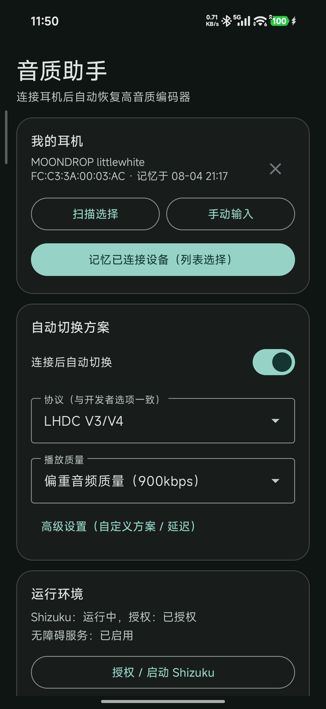
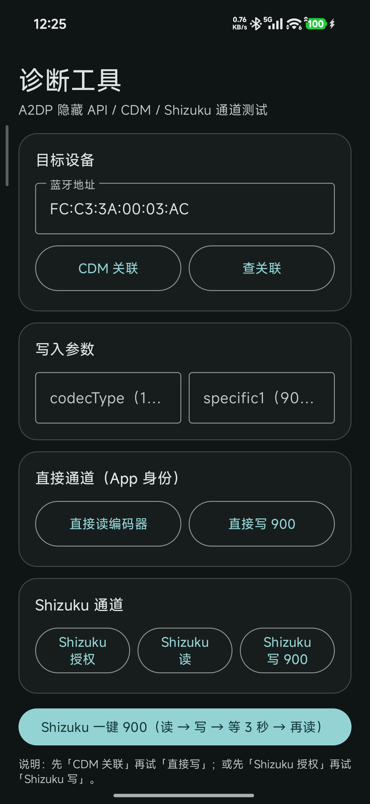

# Bluetooth Codec Auto-Fix

Author: [Halo](https://github.com/Halo0sama)

A no-root Android app for Xiaomi / HyperOS that automatically restores the Bluetooth codec and bitrate you selected (default **LHDC 900 kbps**) every time your earphone reconnects.

<p align="center">
  
  
</p>

## Why

Some earphones (e.g. MOONDROP Little White) fall back to AAC on every reconnect even though they support LHDC. Switching the codec and bitrate back manually each time is tedious — this app does it automatically, with no root.

## Features

- **Auto-fix on reconnect**: works with any earphone out of the box, remembers devices after the first connection, restores codec + bitrate after each A2DP reconnect
- **Full codec list, identical to developer options**: System default / SBC / AAC / aptX / aptX HD / LDAC / aptX Adaptive / aptX TWS+ / LHDC V5 / V3/V4 / V2 / V1 / MIHC / enable & disable optional codecs
- **Bitrate options identical to the settings UI**: e.g. LHDC 990/909, 660/606, 330/303 kbps and adaptive
- **No root**: Shizuku user-service + Accessibility service, no bootloader unlock required
- **Per-earphone presets**: every remembered earphone keeps its own codec + bitrate; tap an earphone to switch to its preset
- **Optional post-flow actions**: exit Settings and resume the current music after the switch completes (both off by default)
- **Custom overrides**: manual device entry, custom row/option labels, trigger delay

## Requirements

- Tested on a Xiaomi phone with HyperOS 3 (Android 16). Other devices and ROMs are **not guaranteed to work** — you can try at your own risk
- Android 8.0+ (API 26+)
- [Shizuku](https://github.com/RikkaApps/Shizuku) running (wireless debugging is enough)

## Install & Setup

1. Download the latest APK from [Releases](../../releases) (or build from source) and install it.
2. Start Shizuku and grant this app the Shizuku API permission.
3. Enable the accessibility service: Settings → Accessibility → 音质助手 (Audio Quality Assistant).
4. Allow **display pop-up windows while running in the background** for this app (MIUI may block background starts otherwise).
5. Open the app, pick your earphone (or leave any-device mode), pick the codec and bitrate, and enable auto-switch.
6. Reconnect your earphone — the codec and bitrate are restored automatically.

## Build

```bash
./gradlew :app:assembleDebug
```

- JDK 17+, Android SDK platform 36 (`compileSdk=36`, `targetSdk=37`)
- Output: `app/app/build/outputs/apk/debug/app-debug.apk`
- Shizuku API jars are vendored under `app/app/libs/`; no extra downloads needed

## How It Works

```
Earphone reconnects (A2DP)
    |
    v
Accessibility service detects the connection
    |
    v
Shizuku shell opens Settings search "LHDC" (fastest route to the audio section)
    |
    v
UI automation selects codec row, then bitrate row
    |
    v
Done — codec stays until the next reconnect
```

- MIUI blocks background activity starts, so the Settings page is opened through the Shizuku shell instead of `startActivity`.
- The unified "LHDC" search keyword works for every codec because it lands directly on the audio section where all codec/bitrate rows live.
- LHDC bitrate values: `codecSpecific1` `0x8001` = 400 kbps, `0x8003` = 900 kbps, `0x8004` = adaptive.
- On other ROMs / devices, labels may differ; use the in-app "custom" overrides or edit `Config.java`.

## License

GPL-3.0. See [LICENSE](./LICENSE).

## Acknowledgments

- [Andrea-lyz/MelodyCodecTweaker](https://github.com/Andrea-lyz/MelodyCodecTweaker) — referenced for the codec-switching approach
- [RikkaApps/Shizuku](https://github.com/RikkaApps/Shizuku) — Shizuku API used for root-free shell access
- [iamr0s/InstallerX](https://github.com/iamr0s/InstallerX) — referenced for predictive-back and UI behavior details

---

# 蓝牙音质助手（Bluetooth Codec Auto-Fix）

作者：[Halo](https://github.com/Halo0sama)

一个**免 Root** 的小米 / HyperOS 安卓应用：耳机每次重连后，自动把开发者选项里的蓝牙编码器和播放质量恢复成你选好的配置（默认 **LHDC 900kbps**）。

<p align="center">
  
  
</p>

## 为什么需要它

有些耳机（比如水月雨小白线）明明支持 LHDC，却每次重连都掉回 AAC。手动切回去又麻烦又容易忘——这个 App 会在重连后自动帮你切回来，全程不需要 Root。

## 功能

- **重连自动修复**：默认对任意耳机生效，连接过一次就自动记忆；每次 A2DP 重连后自动恢复编码器 + 播放质量
- **完整协议列表，与开发者选项完全一致**：使用系统选择（默认）/ SBC / AAC / aptX / aptX HD / LDAC / aptX Adaptive / aptX TWS+ / LHDC V5 / V3/V4 / V2 / V1 / MIHC / 启用与停用可选编解码器
- **比特率选项与系统设置完全一致**：如 LHDC 990/909、660/606、330/303kbps 与自适应
- **免 Root**：Shizuku 用户服务 + 无障碍服务，不需要解锁 Bootloader
- **每耳机预设**：每个记忆的耳机独立保存自己的协议 + 码率，点击耳机即可切换到它的预设
- **完成后可选操作**：切换完成后自动退出设置、继续播放当前音乐（默认均关闭）
- **自定义能力**：手动输入耳机、自定义行文案/选项文案、触发延迟

## 环境要求

- 以小米手机（HyperOS 3 / Android 16）为测试环境；**其他手机 / 系统不保证功能正常**，可自行尝试
- Android 8.0+（API 26+）
- 已启动 [Shizuku](https://github.com/RikkaApps/Shizuku)（无线调试即可）

## 安装与设置

1. 从 [Releases](../../releases) 下载最新 APK（或按下面方法自己编译）并安装。
2. 启动 Shizuku，并给本 App 授予 Shizuku API 权限。
3. 开启无障碍服务：设置 → 无障碍 → 音质助手。
4. 允许本 App **后台弹出界面**（MIUI 不开这个会拦截后台启动）。
5. 打开 App，选择你的耳机（或保持“任意设备”模式），选择协议和码率，打开自动切换。
6. 重连耳机，编码器和播放质量就会自动恢复。

## 编译

```bash
./gradlew :app:assembleDebug
```

- 需要 JDK 17+ 与 Android SDK Platform 36（`compileSdk=36`，`targetSdk=37`）
- 产物：`app/app/build/outputs/apk/debug/app-debug.apk`
- Shizuku API jar 已内置在 `app/app/libs/`，无需额外下载

## 工作原理

```
耳机重连（A2DP）
    |
    v
无障碍服务检测到连接
    |
    v
Shizuku shell 打开设置并搜索 "LHDC"（最快直达音频设置区）
    |
    v
UI 自动化依次选择编码器行、播放质量行
    |
    v
完成——直到下次重连都保持该编码器
```

- MIUI 会拦截后台启动设置页，所以设置页必须通过 Shizuku shell 打开，不能用 `startActivity`。
- 无论选哪种协议都统一搜索 "LHDC"，因为该搜索结果直接落在音频设置区，所有编码器/码率行都在同一屏。
- LHDC 码率数值：`codecSpecific1` `0x8001` = 400kbps、`0x8003` = 900kbps、`0x8004` = 自适应。
- 其他 ROM / 机型文案可能不同：可在 App 内用“自定义”覆盖，或直接改 `Config.java`。

## 许可证

GPL-3.0，详见 [LICENSE](./LICENSE)。

## 鸣谢

- [Andrea-lyz/MelodyCodecTweaker](https://github.com/Andrea-lyz/MelodyCodecTweaker) —— 参考了其编码器切换思路
- [RikkaApps/Shizuku](https://github.com/RikkaApps/Shizuku) —— 本项目使用的 Shizuku API，实现免 Root 执行 shell
- [iamr0s/InstallerX](https://github.com/iamr0s/InstallerX) —— 参考了其预测性返回与界面行为细节
